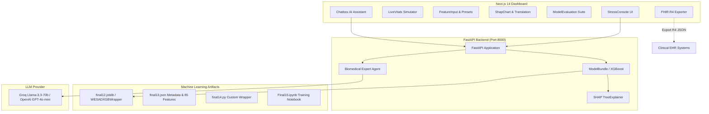

# 🫀 WESAD Physiological Affect Recognition & Stress Detection System

A complete end-to-end clinical and research platform for real-time physiological affect recognition (Baseline, Stress, Amusement, Meditation) using multi-modal wearable sensor data from the WESAD (Wearable Stress and Affect Detection) dataset.

This repository features:
- **XGBoost Machine Learning Pipeline**: 85-feature baseline-normalized classification model trained on ECG, PPG (bvp), and Respiration signals with GroupKFold cross-validation.
- **FastAPI REST API**: High-performance asynchronous backend providing inference, SHAP (SHapley Additive exPlanations) explainability, readiness health checks, and CORS middleware.
- **Biomedical AI Assistant**: Context-aware LLM agent (Groq / OpenAI Llama 3.3 / GPT-4o-mini) providing real-time physiological & clinical analysis.
- **Next.js 14 Clinical Dashboard**: Interactive React frontend with live vitals simulation, SHAP waterfall charts, model evaluation analytics (Confusion Matrix, ROC curves), patient history tracking, FHIR R4 clinical exports, and telehealth consultation modules.

---

## 📐 System Architecture



---

## ⚡ Quick Start

### Prerequisites
- **Python 3.9+**
- **Node.js 18+** and `npm`

---

### 1. Backend Setup & Run

```bash
# Navigate to the backend directory
cd backend

# Create a virtual environment (optional but recommended)
python -m venv venv
# On Windows PowerShell:
.\venv\Scripts\Activate.ps1
# On Linux/macOS:
source venv/bin/activate

# Install dependencies
pip install -r requirements.txt

# Configure Environment (Optional for Chat feature)
cp .env.example .env
# Edit .env and insert your GROQ_API_KEY or OPENAI_API_KEY

# Start the FastAPI server
uvicorn app.main:app --reload --port 8000
```
The API server will run at `http://localhost:8000`. You can inspect interactive API documentation at `http://localhost:8000/docs`.

---

### 2. Frontend Setup & Run

```bash
# Navigate to the frontend directory
cd frontend

# Install dependencies
npm install

# Start the Next.js development server
npm run dev
```
Open your browser and navigate to `http://localhost:3000`.

---

## 📊 WESAD Model & Feature Overview

The machine learning model classifies 4 distinct physiological affect states:

| Class Code | Label | Description |
| :--- | :--- | :--- |
| **1** | `Baseline` | Neutral physiological state |
| **2** | `Stress` | TSST (Trier Social Stress Test) induced acute stress |
| **3** | `Amusement` | Positive emotional response (funny video clips) |
| **4** | `Meditation` | Guided relaxation & deep breathing |

### Feature Engineering (85 Signals)
The model utilizes 85 baseline-normalized physiological features derived from wearable sensors:
- **ECG & Heart Rate Variability (HRV)**: HR, mean/median RR, SDNN, RMSSD, pNN50, LF/HF spectral ratio, Baevsky Stress Index, Hjorth activity/mobility/complexity, Wavelet energy decomposition (L0–L4), Sample Entropy, Higuchi & Katz fractal dimensions.
- **Photoplethysmography (PPG)**: Pulse rate, pulse amplitude, PPG wavelet energy (L0–L4), spectral entropy, SVD entropy, Detrended Fluctuation Analysis (DFA), Signal Quality Index (SQI).
- **Respiration (RESP)**: Respiration rate mean/std, respiration interval coefficient of variation (CV), IQR, amplitude skewness and kurtosis.

---

## 🔌 API Endpoints Summary

| Method | Route | Description | Request Body / Parameters |
| :--- | :--- | :--- | :--- |
| `GET` | `/health` | Readiness probe and model status metadata | None |
| `POST` | `/predict` | Predict affect state & SHAP attributions from 85-feature vector | `{ "features": [float, ... x85], "session_id": str }` |
| `POST` | `/chat` | Context-aware Biomedical AI Assistant conversation | `{ "message": str, "context": { "prediction": str, ... } }` |

For full endpoint documentation and schemas, see [`DOCUMENTATION.md`](file:///c:/Users/aksha/Downloads/final%20project/DOCUMENTATION.md).

---

## 📂 Project Repository Structure

```
final project/
├── README.md                      # Master Project Overview & Quickstart
├── DOCUMENTATION.md               # Detailed Technical & Architecture Documentation
├── final11.csv                    # WESAD extracted 85-feature dataset
├── final12.joblib                 # Trained XGBoost model artifact (WESADXGBWrapper)
├── final13.json                   # Model metadata, training parameters & feature definitions
├── final14.py                     # Custom WESADXGBWrapper class definition
├── Final15.ipynb                  # Jupyter notebook for feature extraction, training & evaluation
├── backend/                       # FastAPI Backend
│   ├── .env.example               # Backend environment variable template
│   ├── requirements.txt           # Python dependency manifest
│   ├── README.md                  # Backend setup instructions
│   └── app/
│       ├── main.py                # FastAPI entrypoint & endpoint handlers
│       ├── model_loader.py        # Model loading singleton & SHAP TreeExplainer wrapper
│       ├── schemas.py             # Pydantic request/response data models
│       └── services/
│           └── multi_agent.py     # LLM Biomedical Expert Agent service
└── frontend/                      # Next.js 14 Web Application
    ├── package.json               # Node.js dependencies & scripts
    ├── README.md                  # Frontend documentation
    ├── app/                       # Next.js App Router (Layout & Global styles)
    ├── components/                # React Dashboard UI Components
    └── lib/                       # Utility functions, FHIR exporter, Demo data & API client
```

---

## 🩺 Clinical Interoperability (FHIR R4)

The application supports exporting patient session data and model inferences into **HL7 FHIR R4 JSON** format:
- `FHIR Observation` resource for physiological vital signs & affect state.
- `FHIR DiagnosticReport` resource containing ML predictions, confidence levels, and SHAP biomarker evidence.

---

## 📄 License

This project is developed for educational, clinical research, and affective computing evaluation purposes using the public WESAD dataset.
